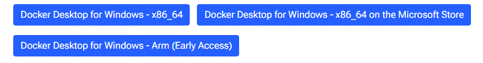
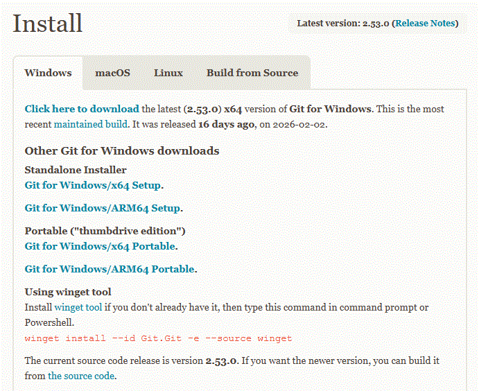
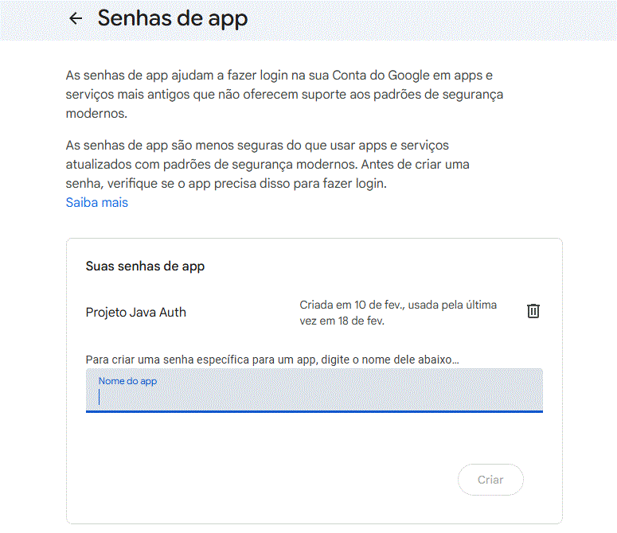

 

<h1 align="center">Auth Application</h1>

###

Esta é uma aplicação de autenticação completa, desenvolvida para demonstrar fluxos de login e gerenciamento de usuários utilizando containers.

###

<h2 align="left">Pré-requisitos</h2>

###

Antes de começar, você precisará ter instalado em sua máquina:  - Docker 
  
  
  https://docs.docker.com/desktop/setup/install/windows-install/
  
   - Git 
  
  

  https://git-scm.com/install/windows

###

<h2 align="left">Como Rodar a Aplicação</h2>

###

Siga os passos abaixo para colocar o projeto em execução:  1. Clonar o Repositório  Abra o seu terminal e execute: git clone https://github.com/joaocastro2/Auth.git cd CAMINHO_DO_REPOSITORIO  2. Configurar Variáveis de Ambiente  O projeto depende de variáveis de ambiente para funcionar. Copie o arquivo de exemplo e cole ma pasta raiz do seu projeto:
  DB_NAME=NOME_BANCO DB_PORT=5432 DB_USER=SEU_USUARIO DB_PASSWORD=SUA_SENHA MAIL_USERNAME=SEU_EMAIL MAIL_PASSWORD=SENHA_DE_APP 
API_URL=http://localhost:8080  Depois abra a pasta "frontend/src", crie outro arquivo .env e adicione: VITE_API_URL=http://localhost:8080  Abra os arquivos .env e preencha com as suas configurações.  2.1. No campo "MAIL_PASSWORD"
será preciso colocar uma senha de app do gmail para conseguir realizar o envio do token, para conseguir essa senha, será preciso criar uma nova senha de app:

 https://myaccount.google.com/apppasswords

  3. Subir o Docker  Com o Docker aberto, execute o comando: docker-compose up -d  Isso irá baixar as imagens necessárias e subir os containers em segundo plano.

###

<h2 align="left">Configuração Pós-Instalação</h2>

###

Para testar o fluxo completo, você precisará ajustar o usuário de teste que já vem pré-cadastrado no banco de dados:  Acesse o terminal na pasta do seu projeto e execute:  docker exec -it auth-db psql -U SEU_USUARIO_AQUI -d SEU_BANCO_AQUI -c "UPDATE customers SET email = 'EMAIL_PARA_TOKEN' WHERE cnpj = '12345678000199';"

###

<h2 align="left">Testando a Aplicação</h2>

###

Após seguir os passos acima, a aplicação estará disponível em: http://localhost:5173  Login: Utilize o cnpj que estará previamente cadastrado no banco "12345678000199".  Após isso chegará um token no e-mail cadastrado.  Logs: Para visualizar o que está acontecendo em tempo real, use docker-compose logs -f.

###
